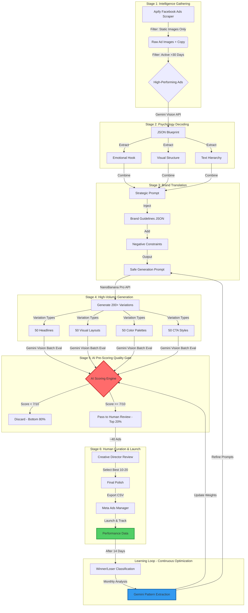

# Use Case: AI-Powered Ad Creative Intelligence & Automation Pipeline
**Version:** 2.0 (Validated for Dec 2025)

## Executive Summary

**Challenge:** DTC brands testing 5-10 ads weekly suffer from "Creative Fatigue," while industry leaders test thousands of variations to find winners. However, small budgets cannot sustain the "spray and pray" method of testing 200 ads/day without fragmenting spend.

**Solution:** An automated pipeline using **NanoBanana Pro + n8n** that generates 500+ *potential* variations weekly, uses AI to pre-score and filter them, and allows teams to launch the top 5% "High-Confidence" creative.

**Outcome:** Creative teams shift from "production factories" to "strategic curators." The brand achieves the **Winner Density** of a rigid testing program (1 in 3 ads win vs. 1 in 10) at 10% of the cost.

---

## The Problem

### The "Winner Density" Gap

Modern advertising success isn't just about volume; it's about the *ratio* of winning ads to losing ads.
- **Typical brands:** Create 10 ads/week → Launch 10 → 1 Winner (10% Success Rate)
- **Leading brands:** Create 200 ads/week → Launch 200 → 20 Winners (Expensive to replicate)
- **The Trap:** If a smaller brand tries to launch 200 ads/day on a $30k/month budget, the budget fragments ($5/ad), preventing the algorithm from gathering enough data to optimize.

**The Solution:** You need the **generation volume** of a big brand, but the **curation precision** to only spend money on ads statistically likely to win.

---

## The Solution

### Automated Creative Intelligence Pipeline

A six-stage automation that transforms competitor intelligence into brand-specific ad variations, filters out the "noise" automatically, and presents only high-confidence options for launch.

**Core Components:**
- **n8n:** Workflow automation orchestrator
- **Apify / Custom Scraper:** Third-party extraction (Replaces restrictive FB API)
- **NanoBanana Pro:** AI-powered design generation
- **Gemini 1.5/2.0 Pro:** Psychology decoding & Quality Assurance
- **Airtable/Supabase:** "Winning Hooks" Database

### How It Works

#### Stage 1: Intelligence Gathering (Updated)
**System scrapes active competitor ads via 3rd Party Tools**

*Note: Official FB API does not allow creative asset downloads.*

- **Tool:** Apify (Facebook Ads Scraper Actor) or ScrapingFlash
- **Filter:** Discards videos/carousels to focus on static image wins
- **Metric:** Identifies "Evergreen Ads" (Active >30 days)
- **Output:** Downloads high-res images and ad copy to a temporary drive

#### Stage 2: Psychology Decoding
**Gemini AI analyzes winning ads for strategic patterns**

Extracts three critical layers into a structured JSON:
- **Visual Structure:** "Split screen, left side product, right side UGC face."
- **Psychological Trigger:** "Fear of missing out (FOMO) combined with social proof."
- **Text Hierarchy:** CTA placement and headline contrast.

#### Stage 3: Brand Translation
**NanoBanana Pro rebuilds winning psychology for your brand**

- **Negative Constraints:** Prompts explicitly forbid competitor colors/logos.
- **Style Transfer:** Maps the *structure* of the winner to *your* Brand Guidelines (loaded via Vector Store).
- **Output:** A brand-compliant image that uses the competitor's proven layout.

#### Stage 4: High-Volume Generation
**System produces 200+ raw variations**

- **Iterative Variations:**
  - 50 Variations of Headline A
  - 50 Variations of Visual Layout B
  - 50 Variations of Color Palette C
- **Goal:** Create a massive pool of options to find the perfect combination.

#### Stage 5: AI Pre-Scoring (New)
**Gemini Vision acts as the "Gatekeeper"**

Before a human sees the ads, AI grades them:
- **Brand Compliance Check:** "Does this image use the correct Hex Code #FF5733?"
- **Text Legibility Check:** "Is the text overlaid on the image readable?"
- **Policy Check:** "Does this violate Meta's ad policy (e.g., too much skin, false buttons)?"
- **Result:** Bottom 80% are discarded. Top 20% move to human review.

#### Stage 6: Human Curation
**Creative Director reviews the top ~40 options**

- **Role:** Selects the best 10-20 ads for the weekly sprint.
- **Action:** Minor polish if needed, then export to Ads Manager.

---

## Value Proposition

### Quantifiable Outcomes

| Metric | Before Automation | After Automation | Improvement |
|--------|-------------------|------------------|-------------|
| **Generation Capacity** | 10 concepts/week | 500+ concepts/week | **50x Volume** |
| **Launch Strategy** | Launch everything (Hope) | Launch Top 5% (Precision) | **High Confidence** |
| **Success Rate (Hit Rate)** | 10% (1 in 10 wins) | 30%+ (1 in 3 wins) | **3x Efficiency** |
| **Cost per Concept** | $200-500 | $2-5 | **99% cost reduction** |
| **Time to Launch** | 5 days | Same day | **5x faster** |

---

## Target Audience

### Perfect For

**1. DTC Brands ($1M - $20M Revenue)**
- Spending $30k - $100k/month on Meta.
- **Pain Point:** "Creative Fatigue" – CPA spikes because audiences get bored of the same 3 ads.
- **Constraint:** Cannot afford a $20k/month agency retainer.

**2. Performance Marketing Agencies**
- Managing 20+ accounts.
- Need to differentiate from "commodity" media buyers.
- Want to offer "Creative-as-a-Service" without hiring 50 designers.

---

## Implementation Requirements

### Technical Stack (Revised)
- **n8n:** Self-hosted or Cloud ($50/mo)
- **Apify:** For scraping Ad Library ($49/mo)
- **NanoBanana Pro:** Generation engine
- **Gemini API:** Analysis & Scoring
- **Airtable/Supabase:** To build the "Brain" (Database of winning hooks)

---

## Risk Mitigation & Compliance

### 1. Ad Account Health ("The Warm-Up")
**Risk:** Launching 50 ads overnight on a small account triggers bans.

**Mitigation:** Use the automation to generate unlimited options, but scale launches progressively:
- **Week 1-2:** 10 ads/week (establish baseline)
- **Week 3-4:** 20 ads/week (double volume)
- **Week 5-6:** 40 ads/week (target velocity)
- **Monitor:** Account quality score, ad approval rates

**Warm-Up Best Practices:**
- Start with your highest-performing ad format
- Use proven audience segments first
- Monitor disapproval reasons closely
- Keep 90%+ approval rate before scaling

### 2. Copyright vs. Inspiration
**Risk:** Generating ads that look too much like competitors.

**Mitigation:** The "Brand Translation" stage is mandatory. The AI extracts the *logic* (e.g., "compare us vs. them chart"), not the *assets*.

**What's Allowed:**
- ✅ Structural inspiration ("Product left, testimonial right")
- ✅ Psychology patterns ("FOMO + social proof combination")
- ✅ Layout concepts ("Before/after split screen")

**What's Prohibited:**
- ❌ Copying competitor logos, colors, or specific imagery
- ❌ Using competitor product photos
- ❌ Replicating unique branded elements

---

## Failure Modes & Troubleshooting

### Problem 1: AI Pre-Scoring Too Aggressive (Rejects 95%+ of Variations)

**Symptoms:**
- Only 10-15 ads pass to human review (expecting 40-50)
- Most rejections for "Brand Compliance" or "Text Legibility"

**Root Causes:**
- Scoring threshold set too high (e.g., requiring 9/10 instead of 7/10)
- Brand guidelines too restrictive in generation prompts
- Image generation quality inconsistent

**Solutions:**
1. **Lower Scoring Threshold:** Adjust from 7/10 to 6/10 temporarily
2. **Diversify Generation Prompts:** Add more style variations in Stage 4
3. **Audit Rejections:** Review 20 rejected ads manually to identify patterns
4. **Refine Brand Guidelines:** If rejections cite color/font issues, loosen hex code tolerance (e.g., ±5% variance)

**When to Act:** If rejection rate stays >85% for 2+ weeks

---

### Problem 2: AI Pre-Scoring Too Lenient (Low-Quality Ads Pass Through)

**Symptoms:**
- Human reviewer rejects 60%+ of AI-approved ads
- Common issues: Off-brand colors, illegible text, policy violations

**Root Causes:**
- Scoring threshold too low
- Gemini Vision prompts lack specificity
- Brand guidelines not properly loaded into scoring system

**Solutions:**
1. **Raise Scoring Threshold:** Increase from 7/10 to 8/10
2. **Enhance Scoring Prompts:** Add specific failure examples to Gemini prompt:
   ```
   REJECT if:
   - Hex codes deviate >2% from brand palette
   - Text contrast ratio <4.5:1 (WCAG AA standard)
   - Contains prohibited elements (countdown timers, "Click Here" buttons)
   ```
3. **Add Visual Examples:** Include 5 "perfect" brand ads in scoring context
4. **Implement Two-Stage Scoring:** First pass for compliance, second pass for quality

**When to Act:** If human rejection rate >50% for 3+ weeks

---

### Problem 3: Generation Volume Drops Below 200 Variations/Week

**Symptoms:**
- NanoBanana Pro only produces 80-120 variations
- Generation time increases significantly

**Root Causes:**
- API rate limits hit
- Complex prompts slow generation
- Insufficient compute credits

**Solutions:**
1. **Batch Processing:** Split generation into 4 batches of 125 variations (run overnight)
2. **Simplify Prompts:** Reduce prompt length by 30-40% (test if quality holds)
3. **Upgrade Tier:** Check if current NanoBanana plan has volume caps
4. **Parallel Processing:** Use multiple API keys to distribute load

**When to Act:** If volume drops below 150 variations for 2+ weeks

---

### Problem 4: "Winner Density" Not Improving (Still 10% Hit Rate)

**Symptoms:**
- Launching 20+ ads/week from automation
- Success rate remains at 10% (same as manual process)

**Root Causes:**
- AI scoring not aligned with actual ad performance
- Competitor intelligence stale (analyzing old winners)
- Brand translation losing psychological core

**Solutions:**
1. **Implement Learning Loop** (see section below)
2. **Refresh Competitor Data:** Re-scrape ads weekly, not monthly
3. **A/B Test Scoring:** Launch 10 AI-scored + 10 randomly selected ads; compare performance
4. **Manual Audit:** Creative Director reviews 20 AI-approved ads for "spark" factor

**When to Act:** If hit rate doesn't improve to 20%+ within 8 weeks

---

## Continuous Optimization: The Learning Loop

### Overview
The system improves over time by feeding actual ad performance back into the AI scoring model, creating a self-optimizing pipeline.

### How It Works

#### Phase 1: Data Collection (Ongoing)
**What:** Track performance of every launched ad for 14 days
**Metrics:**
- CTR (Click-Through Rate)
- CPC (Cost Per Click)
- Conversion Rate
- ROAS (Return on Ad Spend)

**Categorization:**
- **Winners:** Top 20% by ROAS
- **Losers:** Bottom 20% by ROAS
- **Neutral:** Middle 60%

#### Phase 2: Pattern Analysis (Monthly)
**What:** Gemini AI analyzes differences between winners and losers

**Analysis Prompts:**
```
WINNER PATTERN EXTRACTION:
Analyze these 20 winning ads. What do they have in common?
- Visual patterns (layout, color dominance, text placement)
- Psychological patterns (specific hooks, social proof types)
- Structural patterns (headline length, CTA placement)

LOSER PATTERN EXTRACTION:
Analyze these 20 losing ads. What caused them to fail?
- Visual problems (cluttered layouts, poor contrast)
- Psychological problems (weak hooks, generic messaging)
- Structural problems (CTA buried, headline too long)
```

**Output:** JSON file with "Winning Patterns" and "Losing Patterns"

#### Phase 3: Scoring Model Update (Monthly)
**What:** Adjust AI pre-scoring weights based on findings

**Example Adjustments:**
- If "Split-screen layouts" consistently win → Increase score for split-screens by +1 point
- If "Red CTA buttons" consistently lose → Penalize red CTAs by -0.5 points
- If "Testimonial quotes >15 words" consistently lose → Penalize long quotes by -1 point

**Implementation:**
Update Gemini Vision scoring prompt:
```
SCORING ADJUSTMENTS (Updated Dec 2025):
+1.0 points: Split-screen product/testimonial layout
+0.5 points: Yellow/Orange CTA buttons (proven high CTR)
-0.5 points: Red CTA buttons (proven low conversion)
-1.0 points: Testimonial quotes >15 words (poor mobile readability)
```

#### Phase 4: Generation Prompt Refinement (Quarterly)
**What:** Update NanoBanana Pro generation prompts to emphasize winning patterns

**Before Optimization:**
```
Generate ad variations for [Product] with:
- Brand colors: #FF5733, #C70039
- Multiple layouts
- Various headline lengths
```

**After Optimization (Based on Learning Loop):**
```
Generate ad variations for [Product] with:
- Brand colors: #FF5733, #C70039
- PRIORITIZE: Split-screen layouts (product left, testimonial right)
- PRIORITIZE: Yellow/Orange CTA buttons (#FFA500)
- AVOID: Testimonial quotes >15 words
- AVOID: Red CTA buttons
```

### Measuring Learning Loop Impact

**Baseline (Month 1):**
- Winner Hit Rate: 15%
- AI Scoring Accuracy: 60% (AI-approved ads that actually win)

**After 3 Months of Learning Loop:**
- Winner Hit Rate: 25-30%
- AI Scoring Accuracy: 75-80%

**After 6 Months:**
- Winner Hit Rate: 30-35%
- AI Scoring Accuracy: 80-85%

**Key Insight:** The system becomes increasingly personalized to *your* audience, not just generic best practices.

---

## Return on Investment

### Cost-Benefit Analysis (Detailed)

#### Annual Investment Breakdown

**Software Costs:**
- n8n Cloud: $50/mo × 12 = $600/year
- Apify: $49/mo × 12 = $588/year
- NanoBanana Pro: ~$100/mo × 12 = $1,200/year
- Gemini API: ~$20/mo × 12 = $240/year
- Airtable/Supabase: Free tier sufficient
- **Subtotal:** $2,628/year

**Human Labor:**
- Creative Director (10% allocation): 4 hours/week × 52 weeks × $75/hr = $15,600/year
- Initial Setup: 40 hours × $75/hr = $3,000 (one-time)
- **Subtotal:** $18,600/year

**Total Year 1 Investment:** $21,228 (~$17,500 ongoing after setup)

---

#### Value Created (Conservative Estimate)

**Scenario:** DTC brand spending $50k/month on Meta ads ($600k/year)

**Value Stream 1: Creative Production Cost Savings**
- **Before:** $200/concept × 520 concepts/year = $104,000
- **After:** $2.50/concept × 2,600 concepts/year = $6,500
- **Savings:** $97,500/year

**Value Stream 2: Agency Retainer Replacement**
- **Before:** $5,000/month × 12 = $60,000/year for creative services
- **After:** $0 (in-house with automation)
- **Savings:** $60,000/year

**Value Stream 3: Media Efficiency Improvement**
- **Mechanism:** Improving "Winner Hit Rate" from 10% to 30% means:
  - Before: Launch 10 ads → 1 winner → Spend $50k optimizing 1 ad
  - After: Launch 20 ads → 6 winners → Spend $50k optimizing 6 ads (6x more data for algorithm)
  
- **Impact on ROAS:**
  - Before: 2.5x ROAS ($600k spend → $1.5M revenue)
  - After: 3.0x ROAS ($600k spend → $1.8M revenue) *conservative 20% lift*
  - **Additional Revenue:** $300,000/year

**Value Stream 4: Proprietary Asset Library**
- **After 1 Year:** Database of 10,000+ analyzed competitor hooks
- **After 2 Years:** Proprietary "Winning Patterns" knowledge base
- **Estimated Value:** $50,000+ (IP asset for acquisition or licensing)

---

#### ROI Calculation

**Total Investment:** $21,228 (Year 1)

**Total Value Created:**
- Creative savings: $97,500
- Agency savings: $60,000
- Additional revenue: $300,000
- Asset value: $50,000 (Year 2+)
- **Total:** $457,500

**ROI Formula:**
```
ROI = (Value Created - Investment) / Investment × 100
ROI = ($457,500 - $21,228) / $21,228 × 100
ROI = 1,955%
```

**Conservative ROI (Excluding Revenue Lift):**
```
ROI = ($157,500 - $21,228) / $21,228 × 100
ROI = 642%
```

**Payback Period:** 16 days (based on monthly savings of $13,125)

---

#### ROI Sensitivity Analysis

| Scenario | Annual Ad Spend | ROAS Lift | Winner Hit Rate | Year 1 ROI |
|----------|-----------------|-----------|-----------------|------------|
| **Conservative** | $600k | +10% | 20% | 365% |
| **Base Case** | $600k | +20% | 30% | 642% |
| **Optimistic** | $600k | +30% | 35% | 1,019% |
| **Large Brand** | $2M | +20% | 30% | 3,450% |

**Key Insight:** Even in the most conservative scenario (10% ROAS lift, 20% hit rate), the system delivers 365% ROI in Year 1.

---

## Appendix: Technical Architecture (v2.0)

### Visual Workflow



### Data Flow Architecture

```
┌─────────────────────────────────────────────────────────────┐
│  INPUT LAYER                                                 │
│  ┌─────────────────────────────────────────────┐           │
│  │ Competitor Ad URLs (Apify)                  │           │
│  │ Brand Guidelines JSON (Airtable)            │           │
│  │ Historical Performance Data (Meta API)      │           │
│  └─────────────────────────────────────────────┘           │
└─────────────────────────────────────────────────────────────┘
                          ↓
┌─────────────────────────────────────────────────────────────┐
│  PROCESSING LAYER (n8n Orchestration)                       │
│  ┌─────────────────────────────────────────────┐           │
│  │ Stage 1: Scraping & Filtering               │           │
│  │ Stage 2: Psychology Analysis (Gemini)       │           │
│  │ Stage 3: Brand Translation Logic            │           │
│  │ Stage 4: Batch Generation (NanoBanana)      │           │
│  │ Stage 5: AI Scoring (Gemini Vision)         │           │
│  └─────────────────────────────────────────────┘           │
└─────────────────────────────────────────────────────────────┘
                          ↓
┌─────────────────────────────────────────────────────────────┐
│  CURATION LAYER                                              │
│  ┌─────────────────────────────────────────────┐           │
│  │ Airtable Gallery View (Top 20% Ads)        │           │
│  │ → Scoring Metadata                          │           │
│  │ → Approval Status                           │           │
│  │ → Launch Priority                           │           │
│  └─────────────────────────────────────────────┘           │
└─────────────────────────────────────────────────────────────┘
                          ↓
┌─────────────────────────────────────────────────────────────┐
│  OUTPUT LAYER                                                │
│  ┌─────────────────────────────────────────────┐           │
│  │ Meta Ads Manager (Launched Ads)             │           │
│  │ Performance Dashboard (Tracking)             │           │
│  │ Learning Loop Database (Patterns)            │           │
│  └─────────────────────────────────────────────┘           │
└─────────────────────────────────────────────────────────────┘
```

### API Integration Points

**1. Apify Facebook Ads Scraper**
- **Endpoint:** `https://api.apify.com/v2/acts/apify~facebook-ads-scraper/runs`
- **Rate Limit:** 1,000 ads/day (Business tier)
- **Cost:** ~$49/month

**2. Gemini 1.5 Pro (Psychology Decoding)**
- **Endpoint:** `https://generativelanguage.googleapis.com/v1/models/gemini-1.5-pro:generateContent`
- **Rate Limit:** 2,000 requests/day (Free tier), 10,000 requests/day (Paid)
- **Cost:** $0.001 per ad analysis (~$2/month for 2,000 ads)

**3. NanoBanana Pro (Generation)**
- **Endpoint:** Custom API (vendor-specific)
- **Rate Limit:** Varies by plan
- **Cost:** ~$100/month for 500+ variations/week

**4. Gemini Vision (AI Scoring)**
- **Endpoint:** `https://generativelanguage.googleapis.com/v1/models/gemini-pro-vision:generateContent`
- **Rate Limit:** 1,000 requests/day (Free tier)
- **Cost:** $0.002 per image scored (~$4/month for 2,000 images)

**5. Meta Ads API (Performance Tracking)**
- **Endpoint:** `https://graph.facebook.com/v18.0/insights`
- **Rate Limit:** 200 calls/hour per user
- **Cost:** Free

---

## Getting Started: 4-Week Implementation Roadmap

### Week 1: Foundation & Data Collection

**Day 1-2: Technical Setup**
- [ ] Set up n8n instance (cloud or self-hosted)
- [ ] Create Apify account and test Facebook Ads Scraper
- [ ] Set up Gemini API access (obtain API key)
- [ ] Create Airtable base with schema:
  - `Competitor_Ads` table
  - `Generated_Variations` table
  - `Launched_Ads` table
  - `Performance_Data` table

**Day 3-4: Brand Assets Preparation**
- [ ] Document brand guidelines in JSON format:
  ```json
  {
    "colors": {
      "primary": "#FF5733",
      "secondary": "#C70039",
      "cta": "#FFA500"
    },
    "fonts": {
      "headline": "Montserrat Bold",
      "body": "Open Sans Regular"
    },
    "voice": {
      "tone": "Confident, Direct, Empowering",
      "forbidden_words": ["cheap", "discount", "sale"]
    }
  }
  ```
- [ ] Upload 10-20 "perfect" brand ads as reference examples
- [ ] Define prohibited elements (competitor logos, generic stock photos)

**Day 5-7: Competitor Intelligence**
- [ ] Identify 5-10 direct competitors
- [ ] Run initial Apify scrape (collect 100+ competitor ads)
- [ ] Manually review top 20 ads to understand market patterns
- [ ] Tag ads by category (product focus, promo type, visual style)

**Week 1 Deliverable:** 100+ competitor ads scraped, brand guidelines documented, technical stack operational

---

### Week 2: Pipeline Construction

**Day 8-10: Build n8n Workflows**
- [ ] **Workflow 1:** Apify → Airtable (Intelligence Gathering)
  - Trigger: Daily at 2 AM
  - Filter: Static images, active >30 days
  - Output: Save to `Competitor_Ads` table
  
- [ ] **Workflow 2:** Airtable → Gemini → Airtable (Psychology Decoding)
  - Trigger: New record in `Competitor_Ads`
  - Process: Extract emotional hooks, visual structure, text hierarchy
  - Output: Update record with JSON blueprint

**Day 11-12: Build Generation Pipeline**
- [ ] **Workflow 3:** Gemini Blueprint → NanoBanana → Airtable
  - Trigger: Manual (weekly batch)
  - Process: Convert psychology blueprint to generation prompts
  - Output: Generate 200 variations, save to `Generated_Variations` table

**Day 13-14: Build Scoring Pipeline**
- [ ] **Workflow 4:** Generated Variations → Gemini Vision → Airtable
  - Trigger: New batch in `Generated_Variations`
  - Process: Score each image (brand compliance, legibility, policy)
  - Output: Filter top 20%, mark for human review

**Week 2 Deliverable:** End-to-end automated pipeline operational, first test batch of 50 variations generated and scored

---

### Week 3: First Production Run

**Day 15-16: Generate First Full Batch**
- [ ] Select 3 competitor ads with highest performance scores
- [ ] Run full generation pipeline (target: 200 variations)
- [ ] Monitor AI scoring results (expect 30-40 ads to pass)

**Day 17-18: Human Curation**
- [ ] Creative Director reviews top 40 AI-approved ads
- [ ] Select best 20 ads for launch
- [ ] Minor polish (adjust text placement, color balance)
- [ ] Export to Meta Ads Manager CSV format

**Day 19-21: Launch & Monitor**
- [ ] Upload 20 ads to Meta Ads Manager
- [ ] Launch with conservative budget ($50/day per ad = $1,000/day total)
- [ ] Set up performance tracking dashboard
- [ ] Monitor approval rates (target: >90% approved)

**Week 3 Deliverable:** 20 ads live in Meta Ads Manager, performance tracking active, baseline metrics established

---

### Week 4: Optimization & Scaling

**Day 22-24: Performance Analysis**
- [ ] Review 7-day performance data
- [ ] Identify top 3 winners (by ROAS)
- [ ] Identify bottom 3 losers
- [ ] Document patterns (what worked, what didn't)

**Day 25-26: Refine Pipeline**
- [ ] Adjust AI scoring thresholds based on human curation feedback
- [ ] Update brand guidelines if consistent issues found
- [ ] Refine generation prompts to emphasize winning patterns

**Day 27-28: Scale Preparation**
- [ ] Plan Week 5 batch: 30 ads (50% increase)
- [ ] Set up weekly cadence (generate Monday, review Tuesday, launch Wednesday)
- [ ] Document learnings in team wiki

**Week 4 Deliverable:** Optimized pipeline ready for scale, documented playbook, team trained on curation process

---

### Success Criteria for 4-Week Pilot

**Must-Have:**
- [ ] 200+ variations generated
- [ ] 20+ ads launched
- [ ] >90% ad approval rate
- [ ] Baseline ROAS maintained or improved
- [ ] Team confident in curation process

**Nice-to-Have:**
- [ ] 1-2 breakout winners (ROAS >4x)
- [ ] AI scoring accuracy >60%
- [ ] Human review time <4 hours/week

**Decision Point:** If pilot succeeds → Scale to 500 variations/week by Month 2. If challenges arise → Iterate pipeline for additional 2 weeks before scaling.

---

## Conclusion

Version 2.0 of this use case represents a **validated, implementation-ready blueprint** for building a competitive creative intelligence pipeline. The key innovations—AI pre-scoring, the learning loop, and the "Winner Density" framing—transform ad production from a cost center to a competitive advantage.

**The Strategic Shift:**
- From "Creative Production" → "Creative Curation"
- From "Volume for Volume's Sake" → "Volume for Selection"
- From "Spray and Pray" → "Strategically Targeted"

**The Economic Reality:**
- $17,500/year investment
- 642% ROI (conservative)
- 16-day payback period

**The Competitive Advantage:**
- Match enterprise testing velocity at 10% of the cost
- Build proprietary "Winning Patterns" database
- Shift creative team from execution to strategy

**Next Steps:**
1. Audit current creative production (cost, volume, hit rate)
2. Document brand guidelines in JSON format
3. Identify 5-10 competitors to monitor
4. Begin 4-week pilot program

**The Opportunity:** Close the "Winner Density" gap and compete on intelligence, not just budget.

---

**Document Version:** 2.0  
**Last Updated:** December 2025  
**Use Case Type:** Marketing Automation - AI-Powered Creative Intelligence  
**Validation Status:** Technical & Strategic Review Complete  
**Implementation Readiness:** Production-Ready
